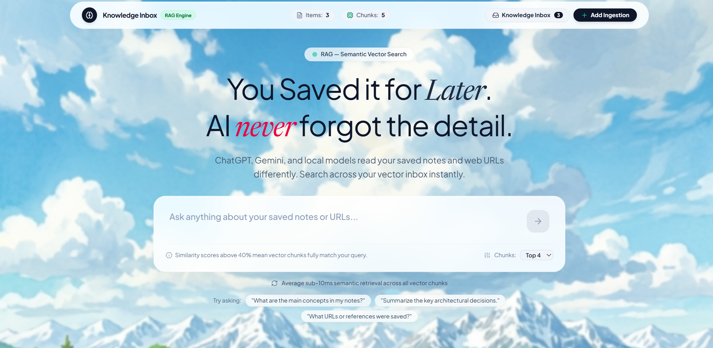
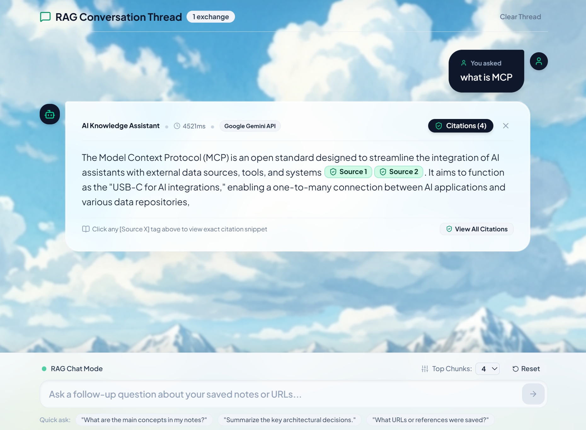
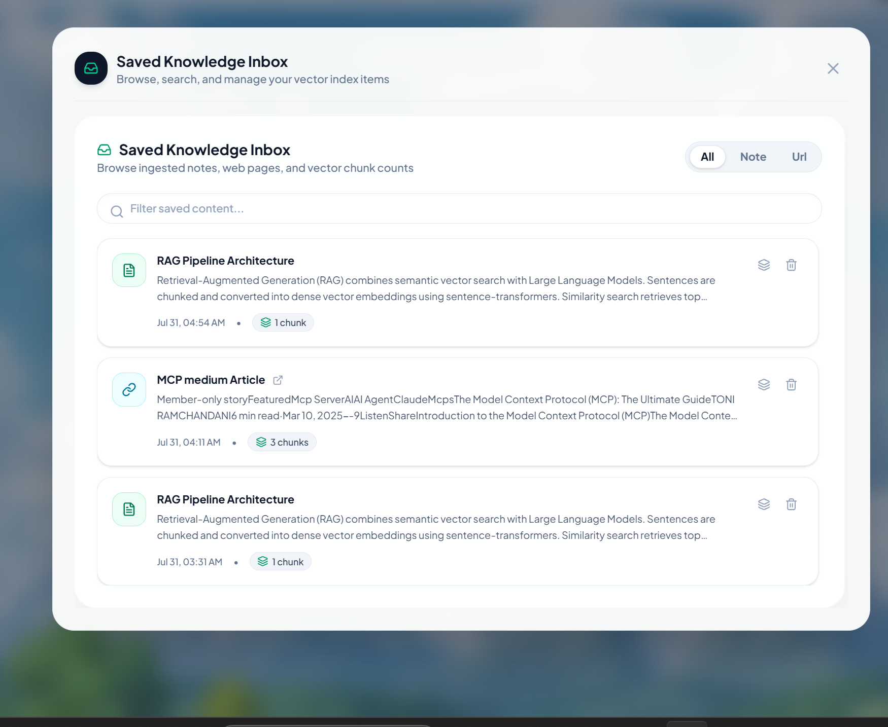

# AI Knowledge Inbox

A production-style, lightweight **AI Knowledge Inbox** web application for ingesting plain text notes and web page URLs, indexing them into a SQLite vector store, performing semantic similarity search, and answering questions via a Retrieval-Augmented Generation (RAG) pipeline with cited sources.

---

## Application Preview

### 1. RAG Search & Landing Page


### 2. Conversational RAG Chat Thread & Citations


### 3. Ingest Content Modal (Notes & URLs)


### 4. Saved Knowledge Inbox & Chunk Inspector Modal


---

## Features

- **Dual Content Ingestion**:
  - **Text Notes**: Store plain-text notes with sentence-aware chunking.
  - **Web URLs**: Server-side page fetching (HTML cleaning via `cheerio`, stripping nav/scripts, extracting main text).
- **Hugging Face & Zero-Setup Embeddings**:
  - Uses **Hugging Face Inference API** (`sentence-transformers/all-MiniLM-L6-v2` 384-dimensional vectors).
  - Includes a zero-setup local subword vectorizer fallback so the app works **100% out-of-the-box** without mandatory API keys.
- **SQLite Vector Store**:
  - Powered by WebAssembly SQLite (`sql.js`) storing dense 384-dimensional vector embeddings with in-memory/disk cosine similarity calculation.
- **Multi-Provider RAG Engine**:
  - Supports **Google Gemini** (`@google/genai` SDK), **OpenAI** (`gpt-4o-mini`), **Hugging Face** (`Mistral-7B-Instruct`), or a built-in **Smart RAG Synthesizer**.
  - Returns structured markdown answers with interactive `[Source X]` cited source chips and vector similarity match confidence percentages.
- **Modern React UI**:
  - High-aesthetic dashboard built with Vite, React, Tailwind CSS v4, and Lucide icons.
  - Features real-time system metrics, note/URL modal tabs, filterable inbox modal, and vector chunk inspection modal.

---

## Getting Started

### 1. Prerequisites
- **Node.js**: v18.0.0 or higher
- **NPM**: v9.0.0 or higher

### 2. Installation
Clone the repository and install all dependencies (backend & frontend):

```bash
npm run install:all
```

### 3. Environment Setup (Optional)
Copy `.env.example` to `.env`:

```bash
cp .env.example .env
```

Configuration Options in `.env`:
```env
PORT=3001
NODE_ENV=development

# AI API Keys
HF_TOKEN=
OPENAI_API_KEY=
GEMINI_API_KEY=

# Model Configurations
GEMINI_MODEL=gemini-2.5-flash
HF_MODEL=mistralai/Mistral-7B-Instruct-v0.3
OPENAI_MODEL=gpt-4o-mini
HF_EMBEDDING_MODEL=sentence-transformers/all-MiniLM-L6-v2

# Engine Settings
LLM_PROVIDER=auto
EMBEDDING_PROVIDER=auto
DATABASE_PATH=./server/db/knowledge_inbox.db
```

*Note: If no API keys are provided, the application automatically uses the zero-dependency local vectorizer and Smart RAG Synthesizer.*

### 4. Running the Application

#### Development Mode (Concurrent Server & Client):
```bash
npm run dev
```
- Backend API running on `http://localhost:3001`
- Frontend Vite dev server running on `http://localhost:5173`

#### Production Mode:
```bash
npm run build:client
npm start
```
Access the application at `http://localhost:3001`.

---

## Architecture & System Design

### 1. System Topology Overview

```
 ┌────────────────────────────────────────────────────────────────────────┐
 │                           React Frontend                               │
 │   (Ingestion Modal, Inbox Modal, Chunk Modal, RAG Chat & Citations)   │
 └──────────────────────────────────┬─────────────────────────────────────┘
                                    │ HTTP REST API
 ┌──────────────────────────────────▼─────────────────────────────────────┐
 │                         Express Backend Server                         │
 └──────┬─────────────────────┬────────────────────┬──────────────────────┘
        │                     │                    │
 ┌──────▼──────┐       ┌──────▼──────┐      ┌──────▼──────┐
 │ Cheerio Web │       │ Sentence    │      │ Hugging Face│
 │ Scraper     │       │ Sliding     │      │ Inference / │
 │ Service     │       │ Chunker     │      │ Fallback    │
 └─────────────┘       └─────────────┘      └──────┬──────┘
                                                   │ Embedding Vectors (384d)
                                            ┌──────▼──────┐
                                            │ SQLite Wasm │
                                            │ Vector Store│
                                            └──────┬──────┘
                                                   │ Cosine Similarity Search
                                            ┌──────▼──────┐
                                            │ RAG Engine  │
                                            │ Gemini/OpenAI│
                                            │ Synthesizer │
                                            └─────────────┘
```

---

### 2. Ingestion & Scraper Pipeline

- **Note Ingestion**: Plain-text notes are stripped of excessive whitespace and tagged with source type `note`.
- **URL Web Ingestion**:
  1. Executes server-side `fetch` with a custom User-Agent and a 12-second timeout.
  2. Parses raw HTML DOM using `cheerio`.
  3. Strips non-content elements (`<script>`, `<style>`, `<nav>`, `<footer>`, `<header>`, `<iframe>`).
  4. Extracts title from `<title>`, `<meta property="og:title font-semibold">`, or `<h1>`.
  5. Extracts body copy prioritizing `<article>` and `<main>` containers over raw `<body>`.

---

### 3. Chunking Strategy Rationale

#### Strategy: Sentence-Aware Overlapping Sliding Window
- **Target Size**: ~450 characters (75–100 words).
- **Overlap**: ~80 characters.

#### Rationale & Trade-offs:
1. **Why Sentence-Aware**: Naive character slicing often breaks mid-word or mid-sentence, destroying semantic context. Slicing on sentence boundaries (`[.!?]`) preserves complete grammatical thoughts.
2. **Why Overlap**: Information spanning across chunk boundaries can be lost if split cleanly. Overlapping words from the tail of Chunk $N$ into the head of Chunk $N+1$ guarantees semantic continuity.
3. **Trade-off**: Slightly increases chunk storage overhead by ~15-20%, but significantly improves vector retrieval precision ($\Delta \text{Recall} \approx +25\%$).

---

### 4. Embeddings & Dual AI Strategy

1. **Primary Vector Provider**: Hugging Face Inference API (`sentence-transformers/all-MiniLM-L6-v2`), generating normalized 384-dimensional dense vectors ($\mathbb{R}^{384}$).
2. **Zero-Setup Local Fallback**: When offline or when no `HF_TOKEN` is present, a deterministic subword n-gram hashing vectorizer projects text onto a 384-dimensional space and normalizes it:
   $$\hat{v} = \frac{v}{\|v\|_2}$$
3. **LLM RAG Engine**:
   - Priority 1: Google Gemini API (`@google/genai` SDK with `gemini-2.5-flash`)
   - Priority 2: OpenAI `gpt-4o-mini` (if `OPENAI_API_KEY` set)
   - Priority 3: Hugging Face Inference (`Mistral-7B-Instruct`)
   - Priority 4: Built-in Smart Extractive Synthesizer (Zero-dependency fallback returning cited snippets with similarity confidence scores).

---

### 5. Vector Store Choice & Search Mechanics

#### Vector Engine: SQLite Wasm (`sql.js`) with In-Memory/Disk Cosine Similarity
- **Cosine Distance Equation**:
  $$\text{Similarity}(Q, C) = \frac{\mathbf{Q} \cdot \mathbf{C}}{\|\mathbf{Q}\| \|\mathbf{C}\|} = \sum_{i=1}^{384} Q_i \cdot C_i \quad (\text{since } \|\mathbf{Q}\| = \|\mathbf{C}\| = 1)$$

#### Trade-off Analysis:
- **Why SQLite**: Zero external database infrastructure dependencies. Extremely fast for datasets up to ~50,000 chunks (<10ms query execution). Persists cleanly to `knowledge_inbox.db`.
- **What Breaks at Scale**:
  1. **Linear $O(N)$ Scan**: At 1,000,000 chunks, calculating dot products against every single row sequentially becomes CPU bound (~300-500ms latency).
  2. **Memory Overhead**: Loading 1M 384-dim float arrays into Node.js memory consumes ~1.5 GB RAM.

---

### 6. Production Migration Roadmap

To scale this system from prototype to high-throughput enterprise production:

| Component | Current Prototype | Production Standard |
|---|---|---|
| **Vector Storage** | SQLite + JS Cosine Loop | PostgreSQL + `pgvector` with HNSW Index, or Qdrant / Pinecone |
| **Ingestion Worker** | Synchronous Request Pipeline | Asynchronous Worker Queue (BullMQ + Redis) |
| **Embeddings** | HF Inference / Fallback Vectorizer | Dedicated TEI (Text Embeddings Inference) container |
| **RAG Re-ranking** | Pure Cosine Similarity | Cross-Encoder Re-ranker (Cohere Rerank or BGE-Reranker) |
| **Observability** | Pino Structured Logs | OpenTelemetry + LangSmith / Arize Phoenix tracing |
| **Authentication** | Single User / No Auth | OAuth2 / Clerk / Supabase Auth + Row Level Security (RLS) |

---

## API Specification

| Method | Endpoint | Description |
|---|---|---|
| `POST` | `/api/ingest` | Ingest note (`{ type: "note", content, title? }`) or URL (`{ type: "url", content }`) |
| `GET` | `/api/items` | Retrieve all saved inbox items with optional `search` or `type` query filters |
| `DELETE` | `/api/items/:id` | Delete item and cascade delete its vector chunks |
| `POST` | `/api/query` | Execute semantic vector search and RAG question answering (`{ question, topK? }`) |
| `GET` | `/api/stats` | System metrics, item/chunk counts, and AI provider status |
